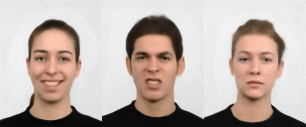

# FaceGen: Generating Faces with Deconvolution Networks

This repo contains code to train and interface with a deconvolution network adapted from [this paper][Chairs] to generate faces using data from the [Radboud Faces Database][RaFD]. Requires [Keras][Keras], [NumPy][NumPy], [SciPy][SciPy], and [tqdm][tqdm] with Python 3 to use.

## Training New Models

To train a new model, simply run:

    python3 facegen.py train path/to/data
    
You can specify the number of deconvolution layers with `-d` to generate larger images, assuming your GPU has the memory for it. You can play with the batch size and the number of kernels per layer (using `-b` and `-k` respectively) until it fits in memory, although this may result in worse results or longer training.

Using 6 deconvolution layers with a batch size of 8 and the default number of kernels per layer, a model was trained on an Nvidia Titan X card (12 GB) to generate 512x640 images in a little over a day.

## Generating Images

To generate images using a trained model, you can specify parameters in a yaml file and run:

    python3 facegen.py generate -m path/to/model -o output/directory -f path/to/params.yaml

There are four different modes you can use to generate images:

* `single`, produce a single image.
* `random`, produce a set of random images.
* `drunk`, similar to random, but produces a more contiguous sequence of images.
* `interpolate`, animate between a set of specified keyframes.

You can find examples of these param files in the `gen` directory, which should give you a good idea of how to format these and what's available.

## Examples

Interpolating between identities and emotions:

Interpolating between orientations: (which the model is unable to learn)

Random generations (using "drunk" mode):

[Chairs]: https://arxiv.org/abs/1411.5928
[RaFD]: http://www.socsci.ru.nl:8180/RaFD2/RaFD?p=main
[Keras]: https://keras.io/
[NumPy]: http://www.numpy.org/
[SciPy]: https://www.scipy.org/
[tqdm]: https://github.com/noamraph/tqdm
